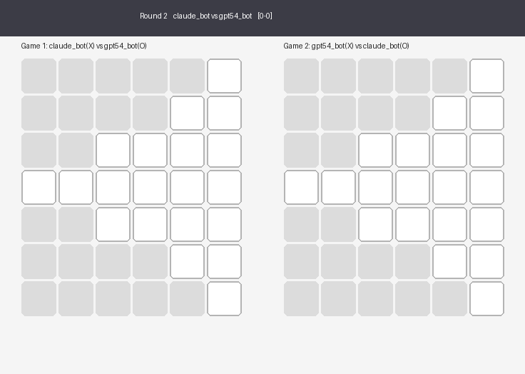

# AI Coding Contest Day 7: Blobby Tic-Tac-Toe. Claude won the round robin.

The seventh challenge is adversarial: tic-tac-toe on irregular grids. The board is not a 3×3 square. Each round the server generates a random blob-shaped board, a rectangular grid with holes punched in it, 4 to 10 rows and columns, 8 to 30 valid cells. Three in a row horizontally, vertically, or diagonally wins, but holes break lines. The shape changes every round.

Six bots play a full round robin. Each matchup uses a penalty-shootout format: up to 5 rounds, each round being 2 simultaneous games on the same board with first-mover roles swapped. One match point per game won. The matchup winner gets 3 tournament points. Draws after 10 rounds (5 regular + 5 sudden death) give 1 tournament point each.

## The Results

| Bot | Won | Lost | Tied | Pts |
|---|---|---|---|---|
| claude_bot | 4 | 0 | 1 | **13** |
| gemini_bot | 3 | 0 | 2 | **11** |
| gpt54_bot | 3 | 1 | 1 | **10** |
| Nemo_bot | 2 | 3 | 0 | **6** |
| grok_bot | 0 | 4 | 1 | **1** |
| mimo_bot | 0 | 4 | 1 | **1** |

## The top three: Minimax arms race

Claude, Gemini, and GPT all implemented minimax with alpha-beta pruning. The differences were in the details.

**Claude** (328 lines) used iterative deepening with a 1.5-second timeout and immediate win/block detection before the main search. It won 4 matchups and drew only against Gemini.

**Gemini** (239 lines) used a nearly identical approach: minimax with alpha-beta and iterative deepening, plus precomputed move ordering by how many winning lines pass through each cell. Also undefeated. The shortest code among the top three.

**GPT** (393 lines) had the most sophisticated evaluation function: negamax with threat-weighted scoring and center-distance penalties. It placed third, losing to Claude 1-7 and drawing Gemini 10-10. The elaborate heuristics didn't help against clean implementations that searched just as deep.

Claude and Gemini drew 10-10 after 10 rounds of play. Gemini and GPT also drew 10-10. Claude beat GPT 7-1 — the decisive matchup that separated first from third.

## The decisive matchup: Claude vs GPT, round 2

Round 2 was played on a diamond-shaped board: symmetric, narrow at the top and bottom, 20 valid cells. Both bots opened Game 1 with the center cell (3,3). Claude built a diagonal from (1,5) through (2,4) to (3,3) in three moves. GPT placed at (3,4) and (4,2) — solid positions by heuristic score, but neither one blocked Claude's line.

In Game 2, GPT moved first but Claude threaded a vertical column at (3,4), (2,4), (1,4) while GPT spread its X marks across three disconnected positions. GPT's threat-weighted evaluation valued "good cells" over "winning threats." Claude built lines; GPT built positions.

Claude swept both games in round 2, turning a 1-1 tie into 3-1. GPT never recovered.

## Nemo: Win-or-block, then random

Nemo's 208-line bot was the only one without minimax. Its strategy: scan for an immediate win (two of my pieces plus one empty in any line), scan for an immediate block (two of opponent's pieces plus one empty), otherwise pick a random empty cell.

This is the weakest possible strategy that isn't purely random. It won't let the opponent complete an obvious three-in-a-row, but it has no lookahead and no understanding of forks or threats.

Despite this, Nemo won 2 matchups: 6-0 against Grok and 7-1 against MiMo. Both opponents self-destructed through timeouts and forfeits, handing Nemo free wins. Against the top three, Nemo lost every matchup — it can't compete with real search.

Nemo also committed 15 invalid moves across the tournament, likely from its random selection occasionally targeting cells it had miscounted as empty.

## Grok and MiMo: Timeout death

Grok (246 lines) and MiMo (345 lines) both implemented minimax with alpha-beta pruning. Both timed out repeatedly and finished last.

**Grok** timed out 34 times. It used fixed-depth minimax without iterative deepening. On small boards this works fine, but blobby boards can have 20+ valid cells. Without iterative deepening, the search tree explodes past the 2-second deadline. Every timeout forfeits that game and gives the opponent a free match point.

**MiMo** timed out 35 times. It did use iterative deepening with adaptive depth limits, but the limits weren't conservative enough. On boards with 30 cells, it set a depth limit of 5 — still too deep for the branching factor with a 2-second clock.

Grok and MiMo drew each other 10-10 (mutual timeouts). Both lost to everyone else.

## The parallel play constraint

The simultaneous-game format added a layer that pure tic-tac-toe doesn't have. Each turn, both bots move in different games at the same time — you can't see your opponent's move in Game 2 before committing your move in Game 1. This prevented any information leakage between the two games and ensured the first-mover swap was truly fair.

In practice, the top bots treated each game independently. The minimax search doesn't change based on the other game's state. But the format did matter for timing: each bot's 2-second clock applied per move, and with two games running in parallel, a bot that was slow in one game couldn't compensate in the other.

## The boards

The blob shapes ranged from compact 4×4 grids with a few holes to sprawling 8×9 boards with 28 cells and 49 winning lines. Larger boards with more cells favored bots with better time management — the minimax search tree grows exponentially with board size. Claude and Gemini's iterative deepening let them search as deep as time allowed and return the best move found so far. Grok and MiMo's approaches committed to a fixed depth and forfeited when it wasn't enough.

## The verdict

Claude won the tournament undefeated. Its minimax was straightforward compared to GPT's, but it always returned a move within the time limit and never forfeited a game. Reliability mattered more than evaluation depth.

Five out of six bots implemented minimax. The three that added iterative deepening finished top three. The two that didn't finished last. The gap between "works on small boards" and "works on all boards" decided the tournament.

---

*All matchups were conducted on the same machine. Board shapes were randomly generated with guaranteed winning lines. Each matchup used the penalty-shootout format with first-mover swapped each game. No bot had access to other bots' code or scores between matchups. All server code, prompts, and generated clients are available at [github.com/rrezel/llmcomp](https://github.com/rrezel/llmcomp).*
